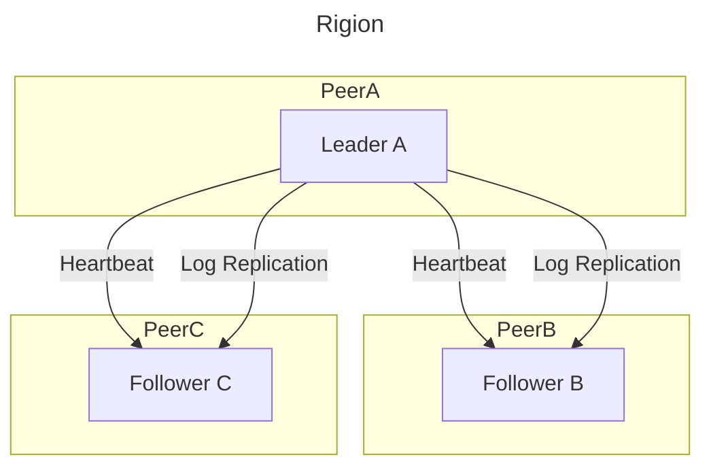

# project2

## 架构设计导读

TinyKV 中使用了 Store、Peer 和 Region 的概念，Store 代表 tinykv 服务器实例，Peer 代表运行在 Store 上的 Raft 节点，Region 是一系列 Peers 的集合，也称为 Raft Group。在 Project2 中，只考虑每个 Store 上一个 Peer，总共一个 Region 的简单情况。

一个`region`是多个`peer`的集合，每个`peer`都是一个 raft 节点，因此`region`也可以称为`raft group`。

每个`peer`上也有一个`storage`实例。

分布式`Storage`在实现上非常复杂，不再直接将`KV`写入到磁盘中，而是先`KV`以`Raft Command`形式发送到其它节点，一致性协议达成一致后再写入到磁盘中。

层级架构比较深，不太好理解，如下：

## 要点

### 2A

实现`Raft`，这点之前在`6.824`中已经实现过了，算法细节就不再赘述了。

需要注意的是，这里的`Raft`实现基本是 clone`etcd`版的，核心建议是不要**闭门造车**，如果对`etcd`不熟悉，想要就自己推出来一个`Raft`，那绝对是难如登天。

课程文档的提示也是相当抽象，建议直接先看看 [etcd](https://www.codedump.info/post/20180922-etcd-raft/) 的实现，然后再看看课程文档，这样会好理解很多。

### 2B

整个 `raftstore` 实际很复杂，但实现的功能却不难，前提是要理解，建议在写代码之前对整个项目代码阅读一下。

核心函数有：

- `HandleRaftReady`；
- `SaveReadyState`；
- `proposeRaftCommand`；

2B 部分无需实现快照，因此可以暂时不考虑快照的问题。

需要注意的是，`propose`是`server层`向`raft层`提交命令，`raft层`会将命令写入到`raft log`中，然后`raft层`相互通信达到一致后，会将`proposal callback`回调到`server层`处理。

### 2C

2C 部分需要实现快照，和上面一样，这部分整体流程很复杂，但实现的功能却不难，前提是要理解。

核心函数有：

- `HandleRaftReady`；
- `ApplySnapshot`；

快照后需要对日志进行`Compact`，需要对日志进行截断，以及日志`Index`进行调整。

## 参考资料

- [谈谈 Raft 分布式共识性算法的实现](https://pedrogao.github.io/posts/distribute/raft.html#%E7%8A%B6%E6%80%81%E6%9C%BA)
- [project2-RaftKV](https://github.com/talent-plan/tinykv/blob/course/doc/project2-RaftKV.md)
- [TinyKV Project2 RaftKV](https://chenyunong.com/2021/08/04/TinyKV-Project2/)
- [Project2](https://www.charstal.com/talent-plan-tinykv-project2/)
- [TinyKV 实现笔记](http://blog.rinchannow.top/tinykv-notes/)
- [Talent Plan TinyKV 白皮书](https://www.inlighting.org/archives/talent-plan-tinykv-white-paper)
- [platoneko/tinykv](https://github.com/platoneko/tinykv)
- [raft zh_cn](https://github.com/maemual/raft-zh_cn/blob/master/raft-zh_cn.md)
- [TinyKv Project2 PartA RaftKV](https://blog.csdn.net/qq_42956653/article/details/126954826)
- [TinyKV-2022-doc](https://github.com/sakura-ysy/TinyKV-2022-doc)
- [tinykv](https://github.com/platoneko/tinykv)
- [etcd Raft 库解析](https://www.codedump.info/post/20180922-etcd-raft/)
- [Talent Plan 之 TinyKV 学习营推荐课程](https://learn.pingcap.com/learner/course/390002)
- [可靠分布式系统-paxos 的直观解释](https://blog.openacid.com/algo/paxos/)
- [Talent Plan 2021 KV 学习营分享课](https://learn.pingcap.com/learner/player/510002)
